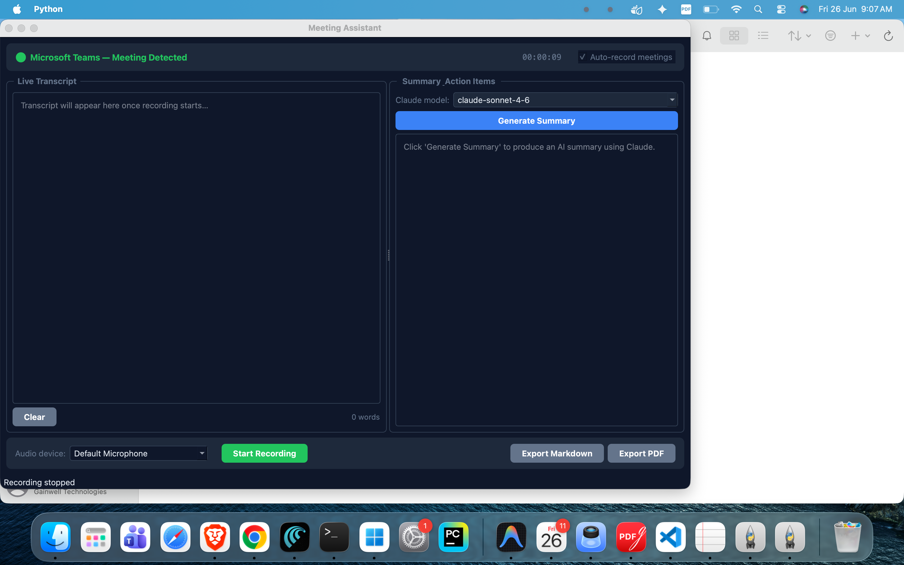

# Meeting Assistant

A macOS desktop application that automatically detects active meetings, records audio, transcribes speech in real-time, and generates AI-powered summaries and action items — all running locally on your machine.

---

## Screenshots

### Main Window — Meeting Detected


> The app automatically detected **Microsoft Teams** and turned the status indicator green. The left panel shows the live transcript area and the right panel has the **Generate Summary** button powered by Claude.

---

## What It Does

| Feature | Details |
|---|---|
| **Meeting Detection** | Automatically detects when Zoom, Microsoft Teams, Webex, Slack, Discord, Skype, FaceTime, or GoToMeeting is running |
| **Audio Recording** | Records microphone input (or full system audio via BlackHole) in 30-second chunks |
| **Live Transcription** | Transcribes speech to text in English using OpenAI Whisper running locally (no data sent to cloud) |
| **AI Summary** | Sends the completed transcript to Claude (via the Claude Code CLI) to generate a structured meeting summary |
| **Action Items** | Extracts tasks, owners, deadlines, and priorities from the conversation |
| **Export Reports** | Saves the transcript + summary as a `.md` or `.pdf` file to this folder |
| **System Tray** | Runs quietly in the menu bar — grey (idle), green (meeting detected), red (recording) |

---

## Project Structure

```
Local_transcript/
├── README.md
├── requirements.txt
├── exports/                     ← saved meeting reports (.md and .pdf)
├── screenshots/                 ← app screenshots
└── meeting_assistant/
    ├── main.py                  ← entry point
    ├── config.py                ← settings (paths, model names, app list)
    ├── core/
    │   ├── meeting_detector.py  ← process monitor (psutil)
    │   ├── audio_recorder.py    ← sounddevice + BlackHole support
    │   ├── transcriber.py       ← faster-whisper (local, CPU)
    │   └── ai_processor.py      ← Claude CLI + Ollama integration
    ├── ui/
    │   ├── main_window.py       ← PyQt6 dark-themed UI
    │   └── system_tray.py       ← macOS menu bar icon
    └── utils/
        └── report_generator.py  ← Markdown + PDF export
```

---

## Prerequisites

- macOS 12 or later
- Python 3.12+ via Homebrew (the macOS system Python is too old — see Step 1 below)
- [Claude Code CLI](https://claude.ai/code) installed and authenticated (`claude` must be on your PATH)
- *(Optional)* [BlackHole](https://existential.audio/blackhole/) for full system audio capture

> **Why not the system Python?**
> macOS ships with Python 3.9.6 (from Xcode Command Line Tools) and pip 21.2.4. This version of pip is too old to resolve PyQt6 binary wheels. Using Homebrew Python 3.12+ avoids this issue entirely.

---

## Installation

### 1. Install Homebrew (if not already installed)

[Homebrew](https://brew.sh) is the recommended package manager for macOS. Open a terminal and run:

```bash
/bin/bash -c "$(curl -fsSL https://raw.githubusercontent.com/Homebrew/install/HEAD/install.sh)"
```

Follow the on-screen instructions. After installation, if prompted, run the two `eval` commands it shows to add Homebrew to your PATH.

Verify Homebrew is installed:

```bash
brew --version
```

### 2. Install Python 3.12 via Homebrew

```bash
brew install python@3.12
```

Verify it installed correctly:

```bash
/opt/homebrew/bin/python3.12 --version
```

You should see: `Python 3.12.x`

### 3. Navigate to the project folder

```bash
cd "/path/to/Meeting Transcripts/Local_transcript"
```

> Replace `/path/to/` with the actual location where you cloned or saved this project.

### 4. Create a virtual environment

A virtual environment keeps all packages isolated, preventing conflicts with other Python projects.

```bash
/opt/homebrew/bin/python3.12 -m venv .venv
```

This creates a `.venv/` folder inside `Local_transcript/`.

> **Note:** The project uses `.venv` (with a leading dot). Do not use the `venv/` directory — it is empty and unused.

> If you are on an Intel Mac (not Apple Silicon), Homebrew installs to `/usr/local` instead of `/opt/homebrew`. Use `/usr/local/bin/python3.12 -m venv .venv` instead.

### 5. Activate the virtual environment

```bash
source .venv/bin/activate
```

Your terminal prompt will change to show `(.venv)` at the start, confirming it is active.

> **Every time you open a new terminal to run the app, you must activate the virtual environment first with the command above.**

To deactivate it when you are done:

```bash
deactivate
```

### 6. Upgrade pip

```bash
pip install --upgrade pip
```

### 7. Install all dependencies

```bash
pip install -r requirements.txt
```

This installs: PyQt6, sounddevice, numpy, psutil, faster-whisper, requests, and reportlab.

> The first install may take a few minutes. faster-whisper will also download the Whisper model (~145 MB) on first run.

### 8. Verify the installation

```bash
python -c "import PyQt6, sounddevice, faster_whisper, psutil, requests, reportlab; print('All packages installed successfully')"
```

You should see: `All packages installed successfully`

### 9. Install and authenticate Claude Code CLI

The app uses the `claude` CLI to generate meeting summaries. Install it and log in:

```bash
npm install -g @anthropic-ai/claude-code
claude login
```

Verify it is on your PATH:

```bash
which claude
```

### 10. (Optional) Install BlackHole for full meeting audio

By default the app records only your microphone, which captures your voice but **not** remote participants.

To capture everything (your voice + remote speakers):

1. Download **BlackHole 2ch** from [https://existential.audio/blackhole](https://existential.audio/blackhole)
2. Install it (no restart needed)
3. Open **Audio MIDI Setup** (found in `/Applications/Utilities/`)
4. Click **+** → **Create Multi-Output Device**
5. Check both **BlackHole 2ch** and your regular speakers/headphones
6. In **System Settings → Sound → Output**, select the Multi-Output Device
7. The app will automatically detect BlackHole and select it as the preferred input

---

## Running the App

> Make sure the virtual environment is active (`source .venv/bin/activate`) before running.

### Launch Meeting Assistant

In your `(.venv)` terminal:

```bash
python meeting_assistant/main.py
```

**Full command if running from a different location:**

```bash
cd "/path/to/Meeting Transcripts/Local_transcript"
source .venv/bin/activate
python meeting_assistant/main.py
```

---

## How to Use

1. **Launch the app** — the main window opens and a menu bar icon appears
2. **Start a meeting** in Zoom, Teams, or any supported app — the app detects it automatically and begins recording (if Auto-record is enabled)
3. **Watch the transcript** appear live in the left panel as you speak
4. **Generate a summary** — click **Generate Summary** once the meeting is done (Claude Code CLI must be installed and authenticated)
5. **Export** — click **Export Markdown** or **Export PDF** to save the report

Reports are saved to the `exports/` folder inside the project directory:
```
Local_transcript/exports/meeting_notes_YYYYMMDD_HHMMSS.md
Local_transcript/exports/meeting_notes_YYYYMMDD_HHMMSS.pdf
```

---

## AI Backend Options

The app supports two AI backends for generating meeting summaries. Choose one based on your preference:

| | Claude Code CLI | Ollama (Free) |
|---|---|---|
| **Cost** | Requires Anthropic account | Free, runs locally |
| **Setup** | Install CLI + login | Install Ollama + pull a model |
| **Quality** | High (Claude Sonnet/Opus) | Good (Llama3, Mistral, etc.) |
| **Internet** | Required | Not required after model download |
| **Privacy** | Transcript sent to Anthropic | 100% local, nothing leaves your machine |

---

## Option A — Claude Code CLI (Default)

Follow **Step 9** in the Installation section to install and authenticate the Claude Code CLI.

In `meeting_assistant/config.py`, set:
```python
AI_BACKEND = "claude"
```

---

## Option B — Ollama (Free, No Account Needed)

### Step 1 — Install Ollama

Download and install Ollama from **https://ollama.com**

Verify installation:
```bash
ollama --version
```

### Step 2 — Pull a model

```bash
# Recommended — good balance of speed and quality
ollama pull llama3

# Alternatives
ollama pull mistral       # fast and accurate
ollama pull phi3          # lightweight, good for low-end machines
ollama pull gemma         # Google's open model
```

> Model sizes range from ~2 GB (phi3) to ~8 GB (llama3). Make sure you have enough disk space.

### Step 3 — Start Ollama server

```bash
ollama serve
```

Leave this terminal open while using the app. Ollama runs at `http://localhost:11434` by default.

### Step 4 — Switch the backend in config

In `meeting_assistant/config.py`, change:
```python
AI_BACKEND = "ollama"
OLLAMA_MODEL = "llama3"   # or whichever model you pulled
```

### Step 5 — Run the app

```bash
source .venv/bin/activate
python meeting_assistant/main.py
```

In the app, the **AI backend** dropdown will show **Ollama (Free, Local)**. Select your model and click **Generate Summary**.

### Available Ollama models

| Model | Size | Best for |
|---|---|---|
| `llama3` | ~4.7 GB | Best quality, recommended |
| `llama3.2` | ~2 GB | Faster, still accurate |
| `mistral` | ~4.1 GB | Fast and accurate |
| `phi3` | ~2.3 GB | Low-resource machines |
| `gemma` | ~5 GB | Alternative option |
| `qwen2` | ~4.4 GB | Multilingual meetings |

> To use a model not in this list, add it to `OLLAMA_MODELS` in `config.py` and pull it with `ollama pull <model-name>`.

---

## Cross-Platform Setup Guide

This section lists **every variable, constant, and path** that must be reviewed or changed before running the app on a new machine or operating system.

---

### 1. `TRANSCRIPT_DIR` — **Must change** (`meeting_assistant/config.py`, line 4)

This is the only hardcoded path in the entire project. Change it to the actual folder where you cloned or saved the project.

```python
# config.py

# macOS / Linux
TRANSCRIPT_DIR = Path("/home/yourname/Documents/Meeting Transcripts/Local_transcript")

# Windows
TRANSCRIPT_DIR = Path(r"C:\Users\yourname\Documents\Meeting Transcripts\Local_transcript")
```

`EXPORTS_DIR` is derived from `TRANSCRIPT_DIR` automatically — no separate change needed.

---

### 2. Virtual environment activation — OS-specific

| OS | Command |
|---|---|
| macOS / Linux | `source .venv/bin/activate` |
| Windows (CMD) | `.venv\Scripts\activate.bat` |
| Windows (PowerShell) | `.venv\Scripts\Activate.ps1` |

---

### 3. Python installation path — OS-specific

Used when **creating** the virtual environment (Step 4 of Installation):

| OS | Command |
|---|---|
| macOS (Apple Silicon) | `/opt/homebrew/bin/python3.12 -m venv .venv` |
| macOS (Intel) | `/usr/local/bin/python3.12 -m venv .venv` |
| Windows | `py -3.12 -m venv .venv` |
| Linux | `python3.12 -m venv .venv` |

---

### 4. `MEETING_PROCESSES` — Windows users must update (`meeting_assistant/config.py`, lines 26–37)

Process names differ across operating systems. On **Windows**, process names include the `.exe` extension:

```python
# config.py — Windows-compatible process names
MEETING_PROCESSES = {
    "Zoom":              ["Zoom.exe", "CptHost.exe"],
    "Microsoft Teams":   ["ms-teams.exe", "Teams.exe"],
    "Webex":             ["CiscoCollabHost.exe", "webex.exe"],
    "Slack":             ["slack.exe"],
    "Discord":           ["Discord.exe"],
    "Skype":             ["Skype.exe"],
    "GoToMeeting":       ["g2mcomm.exe", "GoTo.exe"],
}
```

On **Linux**, use the lowercase binary names (e.g. `zoom`, `teams`, `slack`).

---

### 5. System audio capture — OS-specific (Optional)

Full meeting audio (your voice + remote participants) requires a virtual audio device. The app detects this automatically by name:

| OS | Tool | How the app detects it |
|---|---|---|
| macOS | [BlackHole 2ch](https://existential.audio/blackhole/) | Looks for `"blackhole"` in device name |
| Windows | [VB-Cable](https://vb-audio.com/Cable/) | Add `"CABLE"` to `find_blackhole_device()` in `audio_recorder.py` |
| Linux | PulseAudio Monitor | Add `"monitor"` to `find_blackhole_device()` in `audio_recorder.py` |

To add Windows/Linux support, edit `meeting_assistant/core/audio_recorder.py` line 40:
```python
# Current (macOS only):
if "blackhole" in d["name"].lower() and d["max_input_channels"] > 0:

# Cross-platform:
if any(k in d["name"].lower() for k in ("blackhole", "cable", "monitor")) and d["max_input_channels"] > 0:
```

---

### 6. Claude Code CLI — PATH must be set on all OS

The app calls `claude` via `shutil.which("claude")`. Make sure it is on your system PATH after installation:

| OS | Install | Verify |
|---|---|---|
| macOS / Linux | `npm install -g @anthropic-ai/claude-code` | `which claude` |
| Windows | `npm install -g @anthropic-ai/claude-code` | `where claude` |

If `which claude` returns nothing, add the npm global bin directory to your PATH.

---

### 7. Optional tuning — all in `meeting_assistant/config.py`

These work the same on all operating systems but can be adjusted for your hardware:

| Constant | Default | When to change |
|---|---|---|
| `WHISPER_MODEL` | `"base"` | Use `"tiny"` on slower machines; `"small"` or `"medium"` for better accuracy |
| `CLAUDE_MODEL` | `"claude-sonnet-4-6"` | Change to `"claude-haiku-4-5-20251001"` for faster/cheaper or `"claude-opus-4-7"` for best quality |
| `CHUNK_DURATION` | `30` | Seconds of audio per transcription chunk — lower = more real-time, higher = more accurate |
| `MEETING_CHECK_INTERVAL` | `5` | How often (seconds) the app scans for running meeting apps |
| `SAMPLE_RATE` | `16000` | Whisper expects 16 kHz — only change if you know what you're doing |

---

## Configuration

Edit `meeting_assistant/config.py` to customise:

| Setting | Default | Description |
|---|---|---|
| `WHISPER_MODEL` | `base` | Whisper model size: `tiny`, `base`, `small`, `medium`, `large-v2` |
| `CLAUDE_MODEL` | `claude-sonnet-4-6` | Default Claude model (can also be changed in the UI) |
| `CHUNK_DURATION` | `30` | Seconds of audio per transcription chunk |
| `MEETING_CHECK_INTERVAL` | `5` | How often (seconds) to check for running meeting apps |
| `TRANSCRIPT_DIR` | `Local_transcript/` | Where reports are saved |

### Whisper model guide

| Model | Size | Speed | Accuracy |
|---|---|---|---|
| `tiny` | ~75 MB | Fastest | Basic |
| `base` | ~145 MB | Fast | Good (default) |
| `small` | ~465 MB | Moderate | Better |
| `medium` | ~1.5 GB | Slow | Great |
| `large-v2` | ~3 GB | Slowest | Best |

---

## Supported Meeting Applications

- Zoom
- Microsoft Teams
- Cisco Webex
- Slack (Huddle)
- Discord
- Skype
- FaceTime
- GoToMeeting
- BlueJeans

> Google Meet runs in a browser and cannot be detected by process name. Use the **Start Recording** button manually for browser-based meetings.

---

## Troubleshooting

**`ERROR: Could not find a version that satisfies the requirement PyQt6`**
This means pip is too old (macOS system Python ships with pip 21.x). Fix it by using Homebrew Python 3.12 and recreating the venv:
```bash
rm -rf .venv
/opt/homebrew/bin/python3.12 -m venv .venv
source .venv/bin/activate
pip install --upgrade pip
pip install -r requirements.txt
```

**`ModuleNotFoundError` when running the app**
The virtual environment is not active. Run `source .venv/bin/activate` first, then try again.

**`Claude Code CLI not found` error when generating summary**
The `claude` binary is not on your PATH. Install it with `npm install -g @anthropic-ai/claude-code` and run `claude login`.

**Whisper model takes long to load on first run**
The model is downloaded automatically on first use (~145 MB for `base`). Subsequent launches are instant.

**"Summary Error" when clicking Generate Summary**
Make sure the Claude Code CLI is installed (`which claude`) and authenticated (`claude login`).

**Only my voice is transcribed, not remote participants**
Install BlackHole and follow the setup steps above.

**App not detecting my meeting app**
The app checks process names every 5 seconds. If your app is not listed, add its process name to `MEETING_PROCESSES` in `config.py`.

**Microphone permission denied**
Go to **System Settings → Privacy & Security → Microphone** and grant access to Terminal (or your Python environment).
